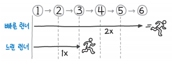

# 런너 기법

연결 리스트를 순회할 때 2개의 포인터를 동시에 사용하는 기법. (투 포인터의 일종?) 한 포인터가 다른 포인터보다 앞서게 하여 병합 지점이나 중간 위치, 길이 등을 판별할 때 유용하게 사용할 수 있다.

보통 빠른 런너, 느린 런너라고 부르는데, 빠른 런너는 2칸씩 이동하고, 느린 런너는 1칸씩 이동한다.
이 때 빠른 런너가 연결 리스트의 끝에 도달하면, 느린 런너는 정확히 연결 리스트의 중간 지점을 가리키게 된다.

이런 식으로 중간 위치를 찾아내면, 여기서부터 값을 비교하거나, 뒤집기를 시도 하는 등 여러 방향으로 활용할 수 있다.
_Q) 뒤집기는 어떻게 시도할 수 있을지?_
